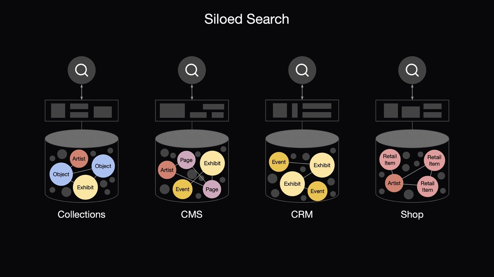

# Architecture

The original project, [museum-nextjs-search](https://github.com/derekphilipau/museum-nextjs-search), was suitable for single-organization installations, with indices representing collections objects, website pages, and archives records.

musefully is a more general solution, providing multi-source ingest, new design, and new website at [https://musefully.org](https://musefully.org)

## Overview

Organizations often run multiple systems, including various CMS platforms added over time as well as SaaS platforms like Shopify.  Content and search is siloed within each system.

Ideally, we'd like to search all our content in one search interface.  One simple solution is syncing systems with the CMS, so that the CMS contains representations of all content.

Some issues from this approach may arise:
1. Compared to specialized search engines like Elasticsearch, the CMS platform might not be as suitable for building a faceted search API.
2. Increasing the number of documents and queries may increase CMS costs.
3. Large datasets such as those in Libraries and Archives may not be suitable for being represented in the CMS.

In light of these issues, it may be best to add a dedicated search engine to take advantage of advanced querying & faceting features.  Large datasets, like Collections and Archives, can be synced to Search instead of the CMS.  The CMS can use the Search API to reference content that is only included in the Search platform.

This project is based on the hybrid approach using a dedicated search engine.  Next.js provides the Frontend, API, and Ingest & Search functionality, with Elasticsearch as the search engine.

## Museum Collections Systems

A typical approach for building a collections website is to periodically sync data from an internal collections management system (sometimes augmented with data from an internal CMS) into a relational database which is queried by a frontend website.

This project takes a different approach, using Elasticsearch as the primary data store and Next.js as the frontend. Note that the collections data is read-only, the actual datastore is in the internal system. Using the last exported files, the Elasticsearch indices can be rebuilt in just a few minutes, even with collections of 200,000 documents.

### Importing data

This project extracts data from a variety of sources:
* Locally loaded CSV/JSON/JSONL files exported from internal collections systems, typically available as Open Access CSV or JSON/JSONL files.
* Web content such as HTML pages and RSS feeds using fetch.

The data is transformed into JSON data that conforms to the Elasticsearch index mapping.  The data is batch upserted into Elasticsearch using standardiezed document ids.  For file-based data loading, Elasticsearch documents that are not contained in the data file are deleted.  

To deploy this sytem, one would need to implement an export/extract step to periodically upload data files from the internal collections management system.

The system could be modified to work from changesets, but using full datasets allows one to quickly rebuild the Elasticsearch index from scratch.
